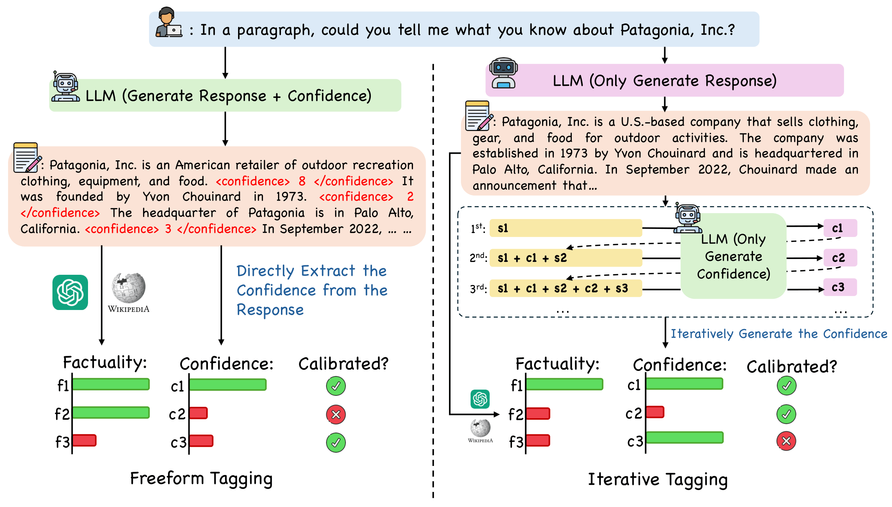

# LoVeC: Reinforcement Learning for Better Verbalized Confidence in Long-Form Generation

<p align="center">
  
</p>

<p align="center">
  <b>ACL 2026 Main Conference</b>
</p>

<p align="center">
  <a href="https://arxiv.org/abs/2505.23912">📄 Paper</a> •
  <a href="#getting-started">🚀 Getting Started</a> •
  <a href="#training">🏋️ Training</a> •
  <a href="#inference--evaluation">📊 Evaluation</a> •
  <a href="#citation">📝 Citation</a>
</p>

---

## Overview

**LoVeC** is an on-the-fly **verbalized confidence estimation** method for long-form text generation. We use **reinforcement learning** to train LLMs to append numerical confidence scores (`0–10`) to each generated sentence, providing a direct and interpretable signal of factual reliability — all in a **single decoding pass**.

### Highlights

- 🎯 **Better Calibration** — RL-trained models (GRPO, DPO, ORPO) consistently outperform prior SOTA (LUQ) on Brier Score, ECE-M, and Spearman Correlation.
- ⚡ **20× Faster** — No multi-sample generation or external API calls at inference; confidence is generated inline with the answer.
- 🌐 **Generalizable** — Trained on WildHallucinations, but generalizes robustly to Bios, PopQA, and even short-form QA (TriviaQA).
- 🔢 **Ordinal Structure** — GRPO-trained models internalize the numerical ordering of confidence scores (e.g., token probabilities for `10 > 9 > 8 > ...`).

### Output Example

```
Patagonia, Inc. is an American retailer of outdoor recreation clothing,
equipment, and food. <confidence> 8 </confidence> It was founded by Yvon
Chouinard in 1973. <confidence> 2 </confidence> The headquarter of Patagonia
is in Palo Alto, California. <confidence> 3 </confidence> ...
```

---

## Repository Structure

```
LoVeC/
├── longform_GRPO.py            # GRPO (on-policy RL) training
├── longform_RL.py              # DPO / ORPO (off-policy RL) training
├── sft.py                      # Supervised fine-tuning baseline
├── sft_data_augmentation.py    # Generate base predictions for SFT data
├── inference.py                # vLLM-based inference (free-form & iterative tagging)
├── ece_eval.py                 # Calibration evaluation (Brier Score, ECE, AUROC, etc.)
├── merge_and_unload.py         # Merge LoRA adapters into the base model
├── case_study.py               # Case study & logprob analysis
├── main.png                    # Teaser figure
├── latest_requirments.txt      # Full pip freeze of our environment
│
├── config/                     # Training configuration templates
│   └── default.py              # Default TrainingConfig dataclass
│
├── evaluating/                 # Online reward computation (used during GRPO training)
│   ├── vllm_evaluator.py       # vLLM-backed judge server for fact-checking
│   └── grpo_reward_evaluator.py# Reward functions (log, quadratic, binary, etc.)
│
├── factchecking/               # Fact-checking pipeline (see its own README)
│   ├── README.md
│   ├── factcheckers/           # GPT-4o-based sentence & atomic fact checkers
│   ├── factcheck_outputs.py
│   ├── generate_atomic_facts.py
│   ├── wiki_retrieval.py       # Evidence retrieval from Wikipedia
│   └── wild_retrieval.py       # Evidence retrieval from web search
│
├── baselines/                  # LUQ baseline re-implementation with vLLM
│   ├── luq_vllm_full.py
│   └── luq_vllm_abridged.py
│
└── utils/                      # Shared utilities
    ├── data_utils.py           # Dataset loading & prompt templates
    ├── eval_utils.py           # Evaluation helper functions
    ├── inference_utils.py      # Iterative confidence tagging logic
    └── training_utils.py       # Config loading & saving
```

---

## Getting Started

```bash
# Clone the repository
git clone https://github.com/<your-org>/LoVeC.git
cd LoVeC

# Install dependencies
pip install -r latest_requirments.txt

# Download NLTK data
python -c "import nltk; nltk.download('punkt')"
```

### Datasets

| Dataset | Source | Usage |
|---|---|---|
| [WildHallucinations](https://huggingface.co/datasets/wentingzhao/WildHallucinations) | HuggingFace | Train (8:1:1 split) + Test |
| [Bios (FActScore)](https://github.com/shmsw25/FActScore) | GitHub | Test only |
| [PopQA](https://github.com/AlexTMallen/adaptive-retrieval) | GitHub | Test only |
| [TriviaQA](https://github.com/mandarjoshi90/triviaqa) | GitHub | Short-form QA test |

WildHallucinations is loaded automatically via HuggingFace `datasets`. For Bios and PopQA, download the data files and provide the path via `--dataset_name`.

### Supported Models

- **Llama-3-8B-Instruct** (`meta-llama/Meta-Llama-3-8B-Instruct`)
- **Gemma-2-9B-It** (`google/gemma-2-9b-it`)

---

## Training

All training scripts use LoRA (<1% trainable parameters) with configurable hyperparameters via a Python config file. See [`config/default.py`](config/default.py) for all available options.

### Step 0: Data Preparation

Generate base model predictions (used for SFT data and off-policy preference pairs):

```bash
python sft_data_augmentation.py \
    --model meta-llama/Meta-Llama-3-8B-Instruct \
    --dataset_name wildhallucination \
    --output_dir sft_data_augmentation_output \
    --apply_chat_template
```

Then use the fact-checking pipeline (`factchecking/`) to label factuality scores and construct preference pairs. See [`factchecking/README.md`](factchecking/README.md) for details.

### Step 1: SFT (Format Adherence)

Before any RL training, fine-tune the model for 1 epoch on winning outputs `y_w` so it learns the `<confidence> X </confidence>` output format:

```bash
python sft.py \
    --config config/default.py \
    --chat_format
```

### Step 2a: GRPO Training (On-Policy)

GRPO requires a **vLLM judge server** running in the background for online fact-checking:

```bash
# Terminal 1: Start the vLLM reward model server
vllm serve meta-llama/Meta-Llama-3-8B-Instruct \
    --dtype bfloat16 \
    --port 8000

# Terminal 2: Run GRPO training
python longform_GRPO.py \
    --config config/default.py \
    --chat_format \
    --with_instruction \
    --evaluate_mode numerical
```

### Step 2b: DPO Training (Off-Policy)

```bash
python longform_RL.py \
    --config config/default.py \
    --rl_mode DPO \
    --chat_format
```

### Step 2c: ORPO Training (Off-Policy)

```bash
python longform_RL.py \
    --config config/default.py \
    --rl_mode ORPO \
    --chat_format
```

### Merging LoRA Weights

After training, merge the LoRA adapter back into the base model:

```bash
python merge_and_unload.py \
    --model_name meta-llama/Meta-Llama-3-8B-Instruct \
    --adapter_path outputs/checkpoint-XXX \
    --output_path outputs/merged_model
```

Alternatively, pass `--merge_lora` to any training script to merge automatically after training.

---

## Inference & Evaluation

### Free-Form Tagging

The model generates both the response and inline confidence scores:

```bash
python inference.py \
    --model_name meta-llama/Meta-Llama-3-8B-Instruct \
    --mode inference \
    --dataset_name wildhallucination \
    --chat_format \
    --with_instruction \
    --lora_path outputs/checkpoint-XXX \
    --max_lora_rank 64 \
    --max_seq_len 512 \
    --save_dir results/
```

### Iterative Tagging

Given fixed model outputs, assign confidence scores sentence-by-sentence:

```bash
python inference.py \
    --model_name meta-llama/Meta-Llama-3-8B-Instruct \
    --mode tagging \
    --tagging_mode concatenate \
    --dataset_name path/to/results.json \
    --chat_format \
    --with_instruction \
    --lora_path outputs/checkpoint-XXX \
    --max_lora_rank 64 \
    --output_dir results/tagged/
```

### Calibration Evaluation

Compute Brier Score, ECE, AUROC, Spearman Correlation, and reliability diagrams:

```bash
python ece_eval.py --config config/default.py --lora_path outputs/checkpoint-XXX
```

---

## Baselines

The `baselines/` folder contains our re-implementation of **LUQ** (Long-text Uncertainty Quantification, Zhang et al. 2024) using vLLM for efficient inference. Two variants are provided:
- `luq_vllm_full.py` — Full LUQ pipeline
- `luq_vllm_abridged.py` — Abridged version for faster experimentation

---

## Fact-Checking

The `factchecking/` directory contains the full fact-checking pipeline used for both training data construction and evaluation. It includes sentence-level and atomic-level fact-checkers powered by GPT-4o, along with evidence retrieval from Wikipedia and web search. See [`factchecking/README.md`](factchecking/README.md) for detailed documentation.

---

## Citation

If you find this work useful, please cite our paper:

```bibtex
@inproceedings{lovec2026,
  title     = {Reinforcement Learning for Better Verbalized Confidence in Long-Form Generation},
  author    = {Zhang, Caiqi and Yang, Ruihan and Zhisong Zhang and Xinting Huang and Sen Yang and Dong Yu and Collier, Nigel},
  booktitle = {Proceedings of the 64th Annual Meeting of the Association for Computational Linguistics (ACL)},
  year      = {2026}
}
```